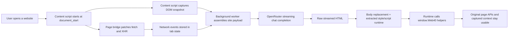

# Web 4.0

Web 4.0 is a Chrome extension that watches a live website, infers how it works from its visible UI and network traffic, and generates a replacement frontend at runtime that still uses the original site's data and APIs.

The generated UI is not just a mockup. By default it replaces the current page body directly and gets a small runtime bridge so it can:

- read the captured page context
- inspect grouped API calls the page already made
- call the site's underlying endpoints again through the page context
- be remixed with a prompt or edited directly in `html`, `css`, and `js`

The default model is OpenRouter `openai/gpt-5.5`, and the user can save an OpenRouter API key locally in Chrome.

## What It Does

- Captures page structure from the current site: headings, buttons, forms, inputs, nav items, links, images, and visible text.
- Captures runtime network traffic by instrumenting `fetch()` and `XMLHttpRequest` in the page context.
- Samples code edges by collecting inline scripts and fetching a few referenced script and stylesheet snippets.
- Sends that snapshot to OpenRouter and asks the model to stream back raw HTML for a replacement frontend.
- Extracts embedded `<style>` and `<script>` blocks from the streamed result so the replacement still works as a live runtime.
- Replaces the current `document.body.innerHTML` instead of previewing inside an iframe.
- Lets the user run a separate remix prompt against the current generated frontend.
- Lets the user manually edit the generated `html`, `css`, and `js` live at runtime.

## How It Works



### 1. Content script boots on every HTTP(S) page

`content-script.js` loads on all regular `http://` and `https://` pages at `document_start`.

It does three important things:

1. injects `page-bridge.js` into the real page context
2. keeps a rolling snapshot of captured network events
3. swaps the live page body when a generated artifact is ready while keeping a lightweight control dock available

### 2. The page bridge instruments live traffic

`page-bridge.js` runs inside the page itself so it can patch the website's real runtime functions.

It currently instruments:

- `window.fetch`
- `XMLHttpRequest`

For each request, it records lightweight metadata such as:

- request method
- request URL
- response status
- response content type
- request body preview
- response body preview
- request duration

This is what makes the generated UI able to reason about the site's real data flows instead of blindly guessing.

### 3. The extension collects a site snapshot

When the user clicks `Analyze current tab`, the background worker asks the content script for a fresh snapshot of the page.

That snapshot includes:

- page title, URL, description, language, viewport
- headings, buttons, forms, links, inputs, images
- a clipped HTML preview
- a visible-text excerpt
- inline script snippets
- referenced external scripts
- referenced stylesheets
- captured network entries

The background worker then fetches a small number of referenced script and stylesheet snippets to improve the model's understanding of the page's behavior.

### 4. The background worker asks OpenRouter for a replacement UI

`background.js` builds a structured prompt and sends it to:

- `https://openrouter.ai/api/v1/chat/completions`

The model is instructed to return raw HTML directly, optionally including inline `<style>` and `<script>` tags. The generated code is required to use runtime helpers such as `window.Web40.callApi()` instead of inventing fake backends.

### 5. The runtime UI is rendered directly into the live page

The content script streams the replacement into the live tab and ultimately replaces `document.body.innerHTML` with the generated markup. At the end of the stream it extracts embedded styles and scripts, applies the CSS, and executes the JS in the real page context.

### 6. Generated UIs get a `window.Web40` runtime bridge

Inside the generated live page, the runtime gets these helpers:

```js
await window.Web40.getPageContext();
await window.Web40.getCapturedApis();
await window.Web40.callApi({ url, method, headers, body, credentials });
window.Web40.log("message");
```

These helpers make the generated frontend useful instead of purely decorative.

`callApi()` routes requests back through the source page context, which helps preserve:

- page cookies
- same-site auth state
- the original site's own request semantics

### 7. Remixing works in two layers

There are two ways to change the generated frontend:

#### Prompt remix

The user can edit a dedicated remix prompt and run the model again against:

- the current site snapshot
- the current captured APIs
- the existing generated frontend

This is useful for large structural changes.

#### Live code remix

The control dock includes editable fields for:

- HTML
- CSS
- JS

The user can apply those edits immediately without leaving the current page. The edited artifact is then persisted back into extension storage for that tab.

## Repository Structure

```text
manifest.json        Manifest V3 definition
background.js        Service worker, OpenRouter orchestration, tab state, storage
content-script.js    Snapshot capture, live body replacement, control dock, runtime editing
page-bridge.js       In-page fetch/XHR instrumentation and page-context runtime bridge
overlay.css          Lightweight fixed control dock styles
popup.html/js/css    Small control surface from the browser action popup
studio.html/js/css   Full-screen designed control studio for prompts and actions
ui-common.js         Shared message helpers for popup and studio
vendor/              Local GSAP vendor files used by the studio page
```

## Settings and Storage

The extension stores data with `chrome.storage.local`.

That includes:

- OpenRouter API key
- selected model
- default generation prompt
- remix prompt
- per-tab generated artifacts
- per-tab status metadata

The API key is stored locally in the browser profile on this machine. It is not sent anywhere except OpenRouter when the extension makes a model request.

## Install

1. Open `chrome://extensions`
2. Enable `Developer mode`
3. Click `Load unpacked`
4. Select this repository folder

## Usage

1. Open any regular `http` or `https` website.
2. If the tab was already open before the extension was loaded, reload it once so early network calls can be captured.
3. Open the Web 4.0 popup or the full Studio page.
4. Paste an OpenRouter key.
5. Keep `openai/gpt-5.5` or replace it with another OpenRouter model.
6. Edit the default generation prompt if desired.
7. Click `Replace current tab`.
8. Watch the streamed replacement take over the current page body.
9. Run `Remix` for another model pass, or edit the generated code directly in the dock.

## Permissions

The extension requests:

- `storage` for settings and artifacts
- `tabs` and `activeTab` for current-tab orchestration
- `scripting` for injecting the content script when needed
- host permissions for all `http://` and `https://` pages

## Current Limits

This implementation is intentionally pragmatic, not a full browser-devtools clone.

It does **not** currently do all of the following:

- full JavaScript decompilation
- full bundle dependency graph extraction
- service-worker traffic capture
- websocket inspection
- HAR export
- a complete Chrome DevTools Protocol trace

What it **does** do today is:

- capture live `fetch` and XHR activity
- collect a meaningful DOM snapshot
- sample page code edges
- generate a working alternate frontend
- preserve access to real page data through a runtime bridge

## Notes on Accuracy

The README wording says the extension "reverse engineers" a site, but in the current code that means:

- inferring behavior from visible DOM
- inspecting live request traffic
- sampling a few script and stylesheet snippets
- regenerating a new UI that can reuse the same data sources

It does **not** mean the extension reconstructs the entire original application architecture perfectly.

## Default Model

The default model is:

- `openai/gpt-5.5`

The model is editable in both the popup and the Studio UI.

## Development Notes

- The Studio page is a local extension page with a custom UI and GSAP-driven motion.
- The live runtime is intentionally plain `html`, `css`, and `js` so model output can be injected directly.
- The current implementation prefers raw streamed HTML over strict structured output so it remains usable even if model formatting is imperfect.

## Why This Exists

Most websites are optimized for the publisher, not the user.

Web 4.0 explores a different idea: treat a website as a live data substrate, then regenerate the interface around user preference without discarding the underlying functionality.
